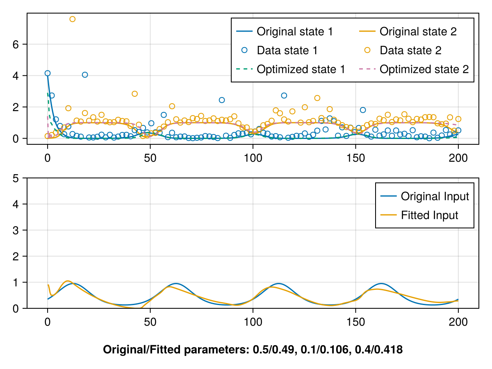

## Essays on Dynamical Systems Identification

This code is a study to use the JuMP library with the identification of dynamical systems.

Please, instantiate the `Manifest.toml`, `] activate .` and `include("main.jl")`.

# Optimization Problem Formulation for CSTR Identification

## Problem Statement

The goal is to simultaneously reconstruct the state trajectory $x(t)$, identify the unknown time-varying dilution rate $u(t) = D(t)$, and estimate the kinetic parameters $(\mu_m, k_s, Y)$ from $n_d = 100$ noisy state measurements $\{(t^d_i,\, y_i)\}_{i=1}^{n_d}$.

This is posed as a single nonlinear program (NLP) where the ODE dynamics enter as hard equality constraints — a strategy known as **direct collocation** or **simultaneous approach**. The key idea is that neither the state trajectory nor the input are integrated forward explicitly; instead, they are all decision variables, and the ODE is enforced algebraically at each grid point by the optimizer.



*Top: true ODE solution (solid), noisy measurements (circles), and optimized trajectory (dashed) for biomass $x_1$ and substrate $x_2$. Bottom: true dilution rate $D(t)$ vs. identified input $u_\text{opt}(t)$. The fitted parameters are shown in the caption.*

---

## Decision Variables

A uniform collocation grid of $n = 500$ points is placed over the time horizon $[0, 200]$:

$$
\mathcal{T} = \{t_1, t_2, \ldots, t_n\}, \quad t_i = (i-1)\,\frac{200}{n-1}
$$

with step sizes $\Delta t_i = t_{i+1} - t_i$ (constant for a uniform grid). The decision variables defined on this grid are:

| Variable | Dimension | Bounds | Description |
|----------|-----------|--------|-------------|
| $x_i \in \mathbb{R}^2$ | $n \times 2$ | $x_i \geq 0$ | State trajectory $[x_1(t_i),\; x_2(t_i)]^\top$ |
| $u_i \in \mathbb{R}$ | $n$ | $u_i \geq 0$ | Dilution rate $D(t_i)$ |
| $p \in \mathbb{R}^3$ | $3$ | $p_j \geq 10^{-3}$ | Kinetic parameters $(\mu_m,\, k_s,\, Y)$ |
| $r_i \in \mathbb{R}$ | $n_d$ | free | Squared fit error at each measurement time |

The non-negativity constraints on $x$ and $u$ encode physical admissibility: concentrations and dilution rates cannot be negative.

---

## Dynamical Constraints

The CSTR model defines the vector field $f : \mathbb{R}^2 \times \mathbb{R}^3 \times \mathbb{R}_{\geq 0} \to \mathbb{R}^2$:

$$
f(x, p, u, t) = \begin{bmatrix}
\mu(x_2,\, p_1,\, p_2)\, x_1 - u\, x_1 \\
u\,(s_f - x_2) - \dfrac{\mu(x_2,\, p_1,\, p_2)}{p_3}\, x_1
\end{bmatrix}, \quad \mu(s, \mu_m, k_s) = \frac{\mu_m\, s}{k_s + s}
$$

The ODE $\dot{x} = f(x, p, u, t)$ is discretized using the **forward Euler** method, producing $n - 1$ vector equality constraints (one per interval):

$$
\boxed{x_{i+1} - x_i - \Delta t_i\, f(x_i,\, p,\, u_i,\, t_i) = 0, \quad i = 1, \ldots, n-1}
$$

Each constraint couples three blocks of decision variables — $x_i$, $x_{i+1}$, and $u_i$ — and is nonlinear due to the Monod term $\mu(x_2) x_1$ and its ratio with $p_3$. The parameter vector $p$ appears in every constraint, making it globally coupled across the entire time horizon. In JuMP, these are registered as symbolic equality constraints and differentiated automatically by IPOPT.

### Why Direct Collocation?

The alternative — simulating the ODE forward from an initial condition — creates a **shooting** problem where parameter perturbations propagate and amplify over long horizons, making the landscape difficult for gradient-based solvers. In direct collocation, the ODE residual at each interval is a local constraint, so the Jacobian of the constraint system is **sparse and banded**: each constraint only involves grid points $i$ and $i+1$. This sparsity is exploited by MUMPS (the linear solver inside IPOPT), keeping factorization cost manageable despite $\sim 1000$ state variables and $\sim 500$ input variables.

### RK4 Variant

A higher-order discretization using **Runge-Kutta 4** is also implemented (commented out). It replaces the single Euler slope with a weighted average of four stage derivatives:

$$
k_1 = f(x_i,\; p,\; u_i,\; t_i)
$$
$$
k_2 = f\!\left(x_i + \tfrac{\Delta t}{2}k_1,\; p,\; \tfrac{u_i + u_{i+1}}{2},\; t_i + \tfrac{\Delta t}{2}\right)
$$
$$
k_3 = f\!\left(x_i + \tfrac{\Delta t}{2}k_2,\; p,\; \tfrac{u_i + u_{i+1}}{2},\; t_i + \tfrac{\Delta t}{2}\right)
$$
$$
k_4 = f\!\left(x_i + \Delta t\, k_3,\; p,\; u_{i+1},\; t_i + \Delta t\right)
$$
$$
x_{i+1} - x_i - \frac{\Delta t}{6}(k_1 + 2k_2 + 2k_3 + k_4) = 0
$$

The input is interpolated linearly between $u_i$ and $u_{i+1}$ across the sub-stages (first-order hold). This is essential: using $u_i$ at all four stages would incorrectly freeze the input at the left endpoint throughout the interval, causing the identified input signal to appear delayed relative to the true one. The tradeoff against Euler is that each RK4 constraint contains four evaluations of the nonlinear $f$, increasing Hessian density and solve time.

---

## Residual Constraints and Interpolation

The collocation grid ($n = 500$ points) and the measurement timestamps ($n_d = 100$ points) are **independent and generally non-coincident**. A measurement at time $t^d_i$ falls somewhere inside an interval $[t_{k-1}, t_k]$ of the collocation grid. Rather than snapping to the nearest grid point (which introduces a discretization error of up to $\Delta t / 2$), the state is **linearly interpolated** between the two bracketing collocation nodes.

### Finding the Bracketing Interval

For each measurement time $t^d_i$, the right bracket index is found as:

```julia
idx = findfirst(t .>= t^d_i)
```

This gives the smallest $k$ such that $t_k \geq t^d_i$, so the measurement sits in the interval $[t_{k-1},\, t_k]$. Three cases are handled:

- **$k = 1$:** the measurement coincides with the first grid point; use $x_1$ directly.
- **$k = \text{nothing}$ or $k > n$:** the measurement falls at or beyond the last grid point; use $x_n$ directly.
- **Otherwise:** linear interpolation between $x_{k-1}$ and $x_k$.

### Interpolated State

The interpolation weight is:

$$
\alpha_i = \frac{t^d_i - t_{k-1}}{t_k - t_{k-1}} \in [0, 1]
$$

and the interpolated state prediction at the measurement time is:

$$
\hat{x}(t^d_i) = (1 - \alpha_i)\, x_{k-1} + \alpha_i\, x_k
$$

Since both $x_{k-1}$ and $x_k$ are decision variables, $\hat{x}(t^d_i)$ is an **affine function of the optimization variables**. The interpolation weights $\alpha_i$ are fixed numbers computed once before the solve, so this adds no nonlinearity.

### Residual Definition

The squared Euclidean distance between the interpolated prediction and the measurement vector $y_i = [y_i^{(1)},\, y_i^{(2)}]^\top$ is bound to the residual variable by an equality constraint:

$$
\boxed{r_i = \bigl((1-\alpha_i)\,x_{k-1}^{(1)} + \alpha_i\,x_k^{(1)} - y_i^{(1)}\bigr)^2 + \bigl((1-\alpha_i)\,x_{k-1}^{(2)} + \alpha_i\,x_k^{(2)} - y_i^{(2)}\bigr)^2}
$$

This is a quadratic equality constraint in the state variables. The use of equality (rather than $\leq$) forces $r_i$ to take the exact squared error, so the objective can be expressed purely in terms of $r_i$ without introducing any slack or gap.

---

## Objective Function

The objective combines three competing terms:

$$
\boxed{\min_{x,\, u,\, p,\, r} \quad \underbrace{0.1 \sum_{i=1}^{n_d} r_i}_{\text{(I) data fit}} + \underbrace{\sum_{i=1}^{n-1} (u_i - u_{i+1})^2}_{\text{(II) input smoothness}} + \underbrace{100 \sum_{j=1}^{3} (p_j - p_j^0)^2}_{\text{(III) parameter regularization}}}
$$

### Term I — Data Fit

$$
0.1\sum_{i=1}^{n_d} r_i
$$

This is a weighted sum of squared residuals between the interpolated collocation trajectory and the noisy measurements. The weight $0.1$ scales the data term relative to the regularization terms. A smaller weight allows the trajectory to deviate from the data more freely (trading fit quality for smoother inputs and closer parameters), while a larger weight forces the trajectory to chase the outliers introduced by the heavy-tailed noise.

### Term II — Input Smoothness (Tikhonov on Finite Differences)

$$
\sum_{i=1}^{n-1} (u_i - u_{i+1})^2
$$

This term penalizes the **first-order finite difference** of the input signal across consecutive collocation points. It is a discrete Tikhonov regularization on the input derivative, equivalent to an $H^1$ seminorm penalty. Without it, the optimizer has $n = 500$ free input values and can fit any oscillation in the noisy data by producing a rapidly varying, physically unrealistic $u(t)$. The smoothness penalty biases the solution toward slowly varying inputs, consistent with the sinusoidal dilution rate expected from the process.

Concretely, if the input changes sharply between consecutive steps — say $u_i = 0$ and $u_{i+1} = 2$ — this contributes $(0-2)^2 = 4$ to the objective. The optimizer avoids such jumps unless the data strongly demands them through Term I. The overall effect is that the identified input is the **smoothest signal consistent with the measured data under the given dynamics**.

Note that this penalty acts as a regularizer on the **rate of change** of the input, not its magnitude. A large but slowly varying $u$ is not penalized, while a small but rapidly oscillating $u$ is — which is exactly the desired behavior for identifying a smooth physical process variable.

### Term III — Parameter Regularization

$$
100\sum_{j=1}^{3} (p_j - p_j^0)^2
$$

The kinetic parameters $(\mu_m, k_s, Y)$ are penalized toward their nominal values $p^0 = (0.5,\; 0.1,\; 0.4)$. The high weight $100$ reflects strong prior confidence in these values and prevents the optimizer from reaching an equivalent fit by compensating erroneous parameters with a distorted input shape. It also improves conditioning: without this term, $p$ and $u$ are partially unidentifiable from state data alone — a different $(p, u)$ pair can produce the same trajectory — and the Hessian becomes singular in those directions.

### Weight Interaction

The three weights jointly determine the solution character:

| Scenario | Effect |
|----------|--------|
| Increase weight I | Trajectory forced closer to outliers; input becomes noisier |
| Increase weight II | Input becomes smoother; trajectory may drift from data |
| Increase weight III | Parameters stay near nominal; input compensates the mismatch |
| Decrease weight III | Parameters free to deviate; risk of non-physical values |

In the current setting the parameter regularization dominates ($\times 100$), the smoothness term is moderate ($\times 1$), and the data term is relaxed ($\times 0.1$), reflecting the fact that the data contains heavy-tailed outliers that should not be fitted exactly.

---

## Full Problem Summary

Collecting all terms, the complete NLP is:

$$
\min_{x,\, u,\, p,\, r} \quad 0.1 \sum_{i=1}^{n_d} r_i + \sum_{i=1}^{n-1}(u_i - u_{i+1})^2 + 100\sum_{j=1}^{3}(p_j - p_j^0)^2
$$

subject to:

$$
x_{i+1} - x_i - \Delta t_i\, f(x_i, p, u_i, t_i) = 0, \quad i = 1,\ldots, n-1 \quad \text{(dynamics)}
$$

$$
r_i = \|(1-\alpha_i)\,x_{k(i)-1} + \alpha_i\,x_{k(i)} - y_i\|_2^2, \quad i = 1,\ldots,n_d \quad \text{(residuals)}
$$

$$
x_i \geq 0, \quad u_i \geq 0, \quad p_j \geq 10^{-3}
$$

The problem has $500 \times 2 + 500 + 3 + 100 = 1603$ decision variables, $499 \times 2 = 998$ nonlinear equality constraints from the dynamics, and $100$ quadratic equality constraints from the residuals. IPOPT solves the first-order KKT conditions using an interior-point method with MUMPS as the sparse linear solver for the Newton step.